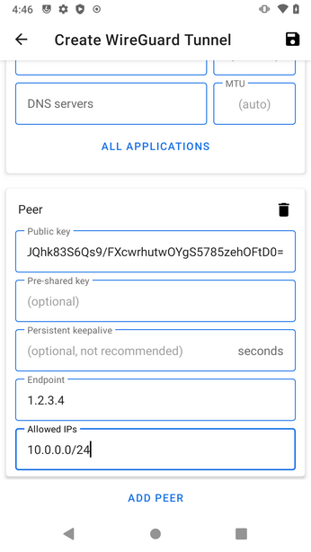
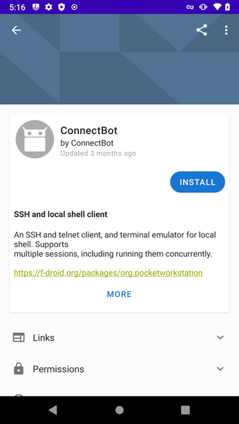

# Intercepting Android Traffic On-Device with frida and mitmproxy

_Note: This post provides technical guidance only. Testing described in this post is done at the reader's own risk and should only be conducted on devices and networks that you have permission to test on._

## Introduction

In order to audit the privacy and security practices of the apps we use on a daily basis, we need to be able to inspect the network traffic they are sending.  An app asking for permission to your location may only use it to send it to your friends, or it may be tracking your every move.  Without knowing exactly what traffic is being sent, [you’d never know](https://www.techlicious.com/blog/android-app-privacy-permissions-tracking/).  Traditionally, this has been the job of dynamic analysis - running the app and capturing traffic as the user interacts with it.  A typical setup might involve a test device where the app runs, connected to a wireless access point running [mitmproxy](https://mitmproxy.org/), [Burp Suite](https://portswigger.net/burp) or something similarly tasked with recording traffic.  An additional control laptop might be added to the mix, which is connected to the test device via USB, to run [`adb`](https://developer.android.com/studio/command-line/adb) commands on the device or overload Java methods using the dynamic instrumentation toolkit [Frida](https://frida.re/).  HTTPS traffic can be intercepted in this way by overloading the app calls to Java's TrustManager and providing our own, which accepts the proxy certificates that we provide.  In combination, this device schema provides a powerful setup to analyze traffic in a stationary, controlled setting.

But what if we don't have the luxury of a testing lab?  What if the app behavior changes based on your location, or interaction with the outside world?  For instance, if you use an app to rent a car or unlock a door to a shared workplace, the real-time behavior of the app will be different from what you can replicate in a lab.  For these kinds of complex interactions, a roaming Machine-in-the-Middle (MitM) schema is needed.  In fact, all three components of the previous schema (test device, interceptor, and control device) will need to be consolidated into a single device running the software required for all three components.  If the app being audited is a form of [disciplinary technology](https://www.eff.org/deeplinks/2021/05/fighting-disciplinary-technologies) – that is, a surveillance app that one person installs on the device of another person – then the auditor will also need to surreptitiously capture traffic being sent by the app, which may pose additional testing complications.

This post will detail the steps involved to configure an Android device to audit the traffic of any app installed on it, requiring no other device to be physically present.  The device will have to be [rooted](https://www.xda-developers.com/root/) in order to install the software required for this setup.  All of the software required in this post is free of cost and open-source, not requiring an extra penny of investment above and beyond that of the device itself.  The end result will allow the user to open an app in a specialized way that allows the traffic to be logged, without attaching extraneous devices or requiring the device to be connected to any specific network or access point.

## Requirements

1. A rooted Android device
2. A basic understanding of the Linux command line
3. A basic understanding of ipv4 networking
4. A PC or VM with Linux (we use Debian 11 `x86_64` below) for cross-compilation steps during setup

We breeze through some of the steps below for the sake of brevity, but almost all are well-documented elsewhere.  Where there isn't sufficient documentation available, we've gone into further detail and provided screenshots.

## Setup

### Overview

In the setup phase, the intention is to allow the user to launch an app in a way that its traffic can be intercepted.  The user should not have to issue any commands themselves to do this.  We will assume there is a third party auditor involved in the setup, who we want to be able to remotely access the device and issue commands.  This allows the auditor, who has a degree of technical proficiency, to be separate from the user, who may have special access to app functionality (such as logging in with their credentials).  The user should only be involved in the process to open and interact with the desired app.  In this example, the app id is `com.example.android` - substitute this for the app you want to audit.

To add a further complication to our setup, we want this to be as automated a process as possible.  The user should not have to manually start services upon device boot.

In order to give the third party auditor access to the device from a remote location, we will have to deal with the likelihood of network switching and being behind a NAT router, not having a publicly routable IP address.  Perhaps the simplest way to resolve this issue is to connect the device to a Wireguard VPN, which we will detail below.  If the auditor and the device operator are one and the same, this step will not be necessary - they can issue commands themselves to prepare for interception locally.

To open the app in a way that allows interception, we'll need `frida-server` daemonized on the phone and `frida-tools` available to run locally.  A `frida-server` module is available for the great low-level Android tool [Magisk](https://github.com/topjohnwu/Magisk) which automatically runs the server at boot.  Allowing `frida-tools` to run locally is a bit more complicated.  We will have to deploy a full Linux distribution on the device, and install `frida-tools` on top of that.

To allow the user to easily launch the app in an interceptable way, on the Linux container we will set up an SSH server which runs a custom `frida` command when a user with a specific SSH key is connected to it.  We will then use the popular Android SSH client [`ConnectBot`](https://connectbot.org/) to generate this SSH key and trigger launching the app.

Finally, we'll need `mitmproxy` installed on the device to view and record the traffic we encounter.

We recommend the device remain plugged in during this setup phase to avoid various complications where Android will background processes to save battery life.

Clearly, a lot of these tools operate at a low level within the Android OS.  This being the case, the first step is to install a custom Android OS which gives us this level of access.

### Flashing the Required OS / Apps

First, you'll have to flash a [recovery](https://en.wikipedia.org/wiki/Android_recovery_mode) image to your test device.  We recommend [TWRP](https://twrp.me/).

Next, boot into recovery mode.  You can find [instructions specific to your device](https://wiki.lineageos.org/devices/).

Connect your device to a PC or VM, and make sure `adb` is installed.  For debian-based distros, it's as simple as `apt-get install adb`.

Next, you'll have to download, push, and flash the following:

1. [LineageOS](https://wiki.lineageos.org/).  Again, reference [the installation guide for your device](https://wiki.lineageos.org/devices/) to download the correct build.
2. [Magisk](https://magiskapp.com/zip/).  This should be a similar flash process to LineageOS above.
3. (Optional) [Open GApps](https://opengapps.org/).  This may or may not be required, depending on the specific app you're auditing.  Note: these apps are closed-source.

### Setup within Android

Reboot the device into the newly installed Lineage OS, and connect to your network.

If you are testing an app which requires installation from the Google Play Store, you may want to connect the device to your Google account for convenience.  This is not strictly required.  You can use the [`apkeep`](https://github.com/EFForg/apkeep) tool we developed to bypass this requirement and install the app of your choice without Google Play being installed on the device.

Install F-Droid from its [website](https://f-droid.org/).  You'll be prompted to allow installing applications from the browser.

#### Configuring WireGuard

The following steps are only required if you want to allow a third party (such as a researcher) to remotely monitor connections.

On a VPS of your choice, set up a WireGuard peer (server) to connect to.  Follow [these](https://upcloud.com/community/tutorials/get-started-wireguard-vpn/) instructions for a break-down of the process.

Open F-Droid and install the WireGuard app.  You'll be prompted to allow installing applications from F-Droid.

Open WireGuard and set up a connection to your VPS WireGuard instance.  For example:

Once this is done, connect to the VPS peer and allow the permission for the app to act as a VPN.  In Settings -> Networks & internet -> Advanced -> VPN, set WireGuard to be an Always-on VPN.

Now, as long as the device is connected to the internet, the third party will be able to reach it.  This is useful in the mobile context where there is frequent switching of network connections.

#### Configuring ConnectBot

ConnectBot is an Android SSH client, and will allow our user to launch the app in a specific way that allows monitoring.

Open F-Droid and install the ConnectBot app.

In ConnectBot, generate a new SSH keypair.

Note the public key, as you will need it later.

Next, add a new host to connect to:

    Protocol: ssh
    android@localhost
    Nickname: MitM App
    Use pubkey authentication: <choose the key you just generated>

#### Installing SimpleSSHD

We will need SimpleSSHD to transfer files from the Linux container later.

Open F-Droid and install the SimpleSSHD app.

Open SimpleSSHD and start the SSH daemon.  In the app settings, enable "Start on Boot."

#### Installing Magisk and Frida Server

Now you will want to install a Magisk module to start the Frida server upon device boot.

First, download the latest release of [`magisk-frida`](https://github.com/ViRb3/magisk-frida/releases) to your device.  This may fail to download the correct `zip` file in the default browser.  If this happens, try downloading it in another browser. 

Previously, we flashed Magisk to our device when we were in recovery mode.  This should have added a Magisk app to our installed apps.  Open it, and continue to install the full app when asked.

Installing the full Magisk app will overwrite the bootstrap app.  Open Magisk, and go to the Modules tab.  Tap "Install from Storage" and select the `zip` you previously downloaded to install it.  You will need to reboot the device.

#### Deploying Linux on the Device

We will need to install a full distribution of Linux on the device in order to launch apps via Frida locally in a way that allows interception of network traffic.

Install Linux Deploy from its [GitHub repo](https://github.com/meefik/linuxdeploy/releases/).

Before configuring or installing Linux from the default configuration, a few settings need to be changed.  Tap the lower-left corner of the screen to go into settings for this configuration, and change the distribution to debian stable.  The image size should be at least 4G.  Enable the `init` system and SSH server.  Copy the password for the user as well.

Now you can select "install" from the top-right menu, then "start" to start the container.

Lastly, go into the app-wide settings and enable autostart.  We've found it convenient to change the autostart delay to 10 seconds.

### Android Linux Container

Using ConnectBot, you should be able to log in to the Linux container with the profile we previously set up and the password you copied in a prior step.

Use the following commands to install our dependencies:

    sudo apt install tmux python3-venv python3-dev gcc-arm-linux-gnueabihf python3-pyasn1 python3-flask python3-urwid libxml2-dev libxslt-dev libffi-dev python3-pip libssl-dev zlib1g-dev iptables rustc
    pip install mitmproxy prompt_toolkit pygments

and allow us to connect to the host Android SSH instance with a new SSH key:

    ssh-keygen # enter, enter, enter
    scp -P 2222 .ssh/id_rsa.pub localhost:./authorized_keys

In the SimpleSSHD app, you will see a new temporary password to enter at the prompt.  Next:

    editor ~/.ssh/authorized_keys

Switch back to the ConnectBot keystore and copy the public key we previously noted.  Using this public key, enter the following into the editor and save:

    command="/home/android/frida_*/bin/frida -H 127.0.0.1 -f com.example.android -l frida-android-repinning.js --no-pause",no-agent-forwarding,no-x11-forwarding,no-port-forwarding CONNECTBOT_PUBKEY_HERE

Lastly, create the `frida-android-repinning.js` script referenced above to the home directory.  You can find the script [here](https://codeshare.frida.re/@pcipolloni/universal-android-ssl-pinning-bypass-with-frida/).  Special thanks to @pcipolloni for writing it.

You can log out of the container.  Now, when we connect to our local Linux host with ConnectBot, it will automatically attempt to issue a command to open our desired app with `frida`.  The next step is to install the `frida-tools` within our Linux container.

### Compiling Frida Tools for Android

Unfortunately, we run into some problems when installing `frida-tools` the typical way, via `pip`:

    ImportError: /home/android/.local/lib/python3.9/site-packages/_frida.cpython-39-arm-linux-gnueabihf.so: wrong ELF class: ELFCLASS64

It looks like installing the tools via `pip` on an Android platform isn't expected.  Fortunately, there is another way to build and install.  We can compile the tools directly from the Frida repository.  We've found compiling directly on an Android device to take a prohibitively long time, so in this example we've opted to cross-compile on a more powerful machine.  Here, we're using a Debian 11 `x86_64` build environment.  Even for `arm64` / `aarch64` devices, we've had better luck compiling to `armhf`.  Instructions for devices with Intel-based chipsets will be different.

    sudo dpkg --add-architecture armhf
    sudo apt update
    sudo apt install curl git npm pkg-config gcc-arm-linux-gnueabihf g++-arm-linux-gnueabihf libpython3.9-dev:armhf
    git clone --recurse-submodules https://github.com/frida/frida.git
    cd frida && make tools-linux-armhf

Once this is finished, we will have `frida-tools` available in a format runnable on the device.  Copy it over:

    scp -r build/frida_thin-linux-armhf/ android@device_ip:.

Finally, back on the Android device, run the following line: 

    ln -s /home/android/frida_thin-linux-armhf/bin/* .local/bin/

This should add the `frida-tools` binaries to your `$PATH` so you can run them directly in a shell.  You can test if it is connecting to the local `frida-server` by running

    frida-ps -H 127.0.0.1

If you see a list of processes, `frida` is working properly.  If you see an error, something has gone wrong.

## Real-Time Interception

With setup complete, we have all we need to start a real-time interception.  The following steps are run every time an interception is made.

With Wireguard set up to auto-connect at boot, the auditor should be able to SSH to the phone without a problem.  We want to ensure that the auditor is able to re-connect to any commands running on the device should they become disconnected.  Luckily, we've installed the terminal emulator [`tmux`](https://github.com/tmux/tmux/wiki) above.

Start a new `tmux` session with `tmux new -s interception`.  Here, set up `iptables` rules to redirect any traffic of the desired app to our `mitmproxy` instance.  In Android, each app has a unique UID assigned to it.  To find it, you can reference the file `/data/system/packages.xml` from an Android terminal (*not* within the Linux container).  Alternatively, simply run the app and within the Linux container issue a `ps aux | grep com.example.android`.  With this UID handy, we can issue the following commands:

    APP_UID=10154 # modify this line
    sudo iptables-legacy -t nat -A OUTPUT -p tcp --dport 80 -m owner --uid-owner $APP_UID -j DNAT --to 127.0.0.1:8080
    sudo iptables-legacy -t nat -A OUTPUT -p tcp --dport 443 -m owner --uid-owner $APP_UID -j DNAT --to 127.0.0.1:8080
    mitmproxy --mode transparent

`iptables` will now *only* be intercepting traffic generated by our desired app, which ignores all other system traffic.

In a second `tmux` session, we will install the forged certificate generated by `mitmproxy` into the host system.  Copy the certificate:

    cat ~/.mitmproxy/mitmproxy-ca-cert.cer

Then install the certificate as the `shell` user:

    ssh -p 2222 localhost
    su - shell
    echo "PASTED_CERTIFICATE_HERE" > /data/local/tmp/cert-der.crt
    chmod o+r /data/local/tmp/cert-der.crt

Now that we have the certificate installed where the host Android OS can access it, we can test whether it all works!  Back in the Linux container, run:

    frida -H 127.0.0.1 -f com.example.android -l frida-android-repinning.js --no-pause

Now switch to the `mitmproxy` `tmux` session and observe traffic rolling on through.

Now that we've confirmed everything works together seamlessly, we won't have to run the `frida` command manually.  Just have the auditor set up the `iptables` rules and `mitmproxy` to run after boot (or [automate](https://www.github.com/efforg/roaming-android-mitm/blob/main/iptables-mitmproxy-init-script.sh) this with the `init` system in the Linux container). Then, the user can open the app when they want it audited.

## Conclusion

Lots of apps that we use everyday spy on us without our knowledge.  One way to fight back is to expose the spying by analyzing an app’s network traffic.  But testing an app in a controlled lab is not always possible or desirable.  But as we have demonstrated, we can still perform an audit of an app, and observe how its behaviors might change when run on the go.  We hope this demonstration will prove fruitful for those investigating the security and privacy properties of apps in real-world situations.
